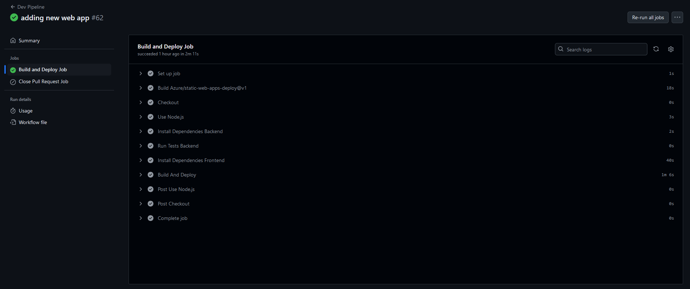
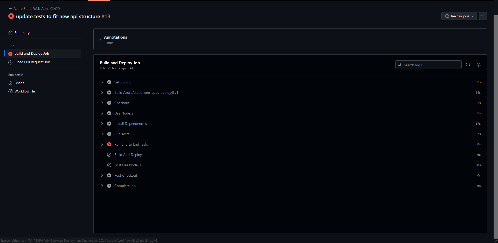
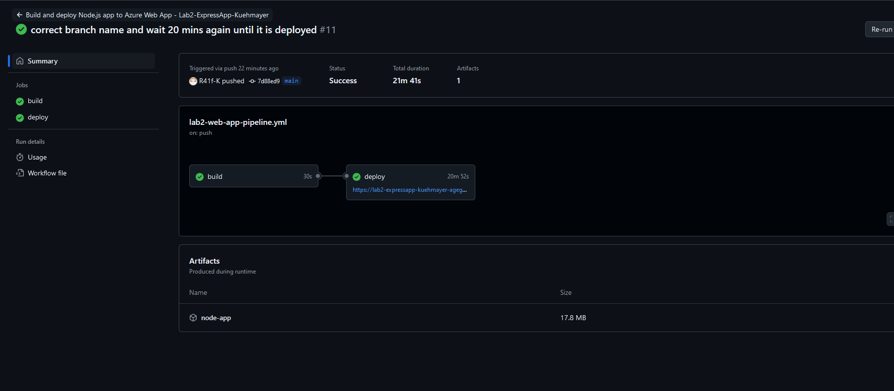
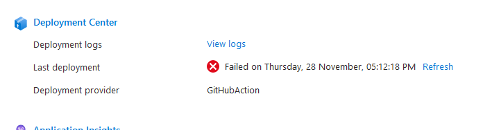
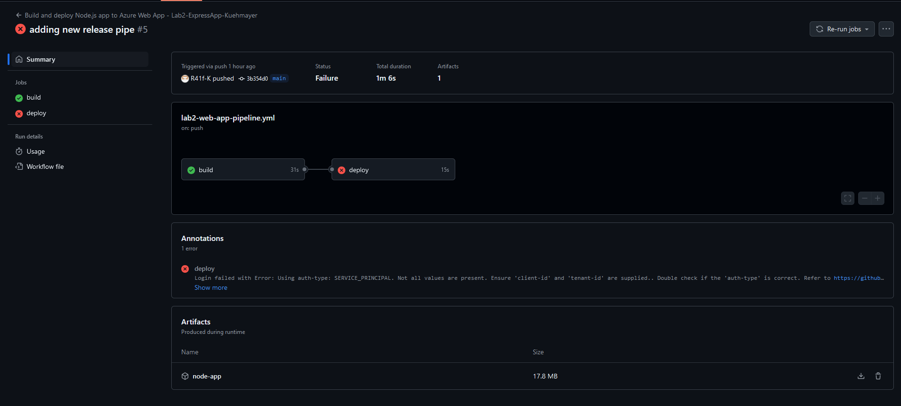
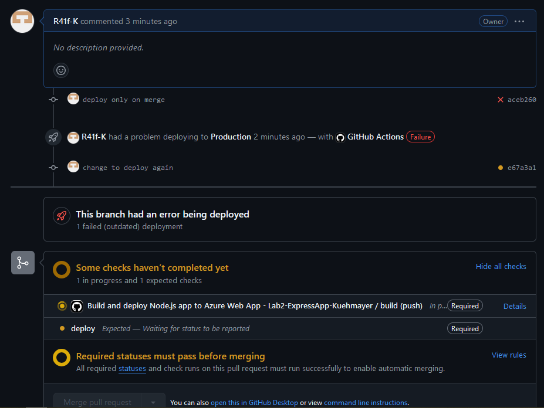
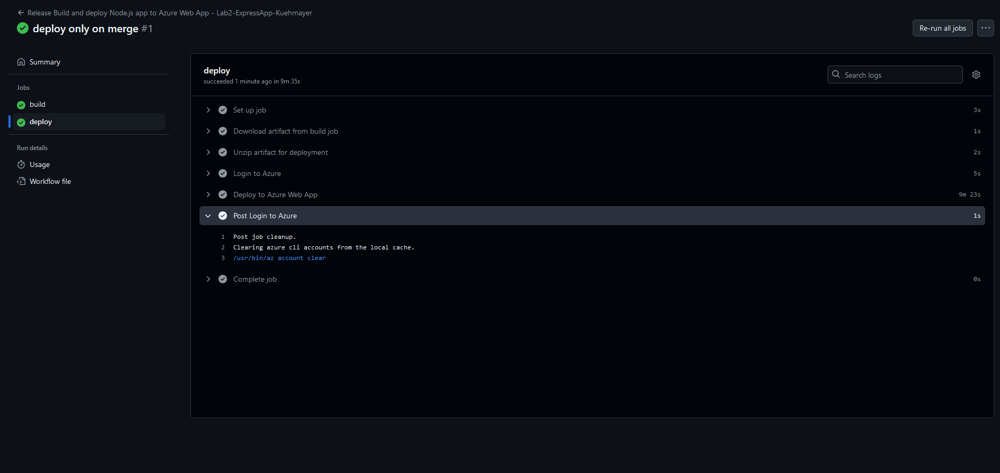

# Lab2

The Static Web Apps could be deployed but I couldn't get the functions app in the backend to run the fronted works fine.
Therfore I also created a Web App with an express app with tests. 
For the Web App the github actions show successfull deployments but azure shows that they fail and the web app fails. I couldn't figure out why.

The apps are cloned from gihub repos. The orignials are linked with submodules.

## Web Links
1. [Static Web App Dev](https://black-grass-028e00e03.5.azurestaticapps.net/)
2. [Static Web App Production](https://salmon-grass-09729c803-10.westeurope.5.azurestaticapps.net/)
3. [Web App Dev](https://lab2-expressapp-kuehmayer-agegava9ftc9g5ez.westeurope-01.azurewebsites.net/)
4. [Web App Production](https://lab2-expressapp-kuehmayer-production-gqgzbfh7hadcbhge.germanywestcentral-01.azurewebsites.net/)

## Pictures Section

*Successfull delopyment of the static web app*

*Failed test on the delopyment of the static web app; first tries I changed the app afterwards and the new app doesn't have tests*

*Successfull delopyment of the web app (21 mins...)*

*Azure shows that the deplyoment failed even if the gihub action shows success*

*Failed deployment for the web app (wrong credentials)*

*Release Policy, only mergable if build and deployed to dev*

*Release Deplyoment pipline success*

## Deployment Policy

Releases are only deployed if:
1. A pull request has been created.
2. The branch from which the pull request originates has already been successfully deployed to the `dev` environment.
3. The pull request must be approved by a number of reviewers (for this project 0 as I'm only one developer and you cant approve your own pull requests)

The release branches are protected from github from pushes and code can only be added with a pull request.