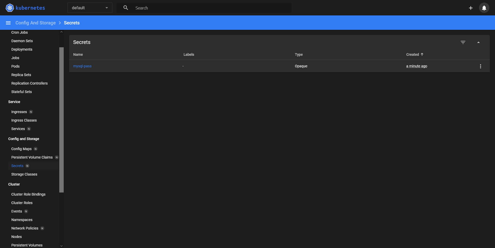
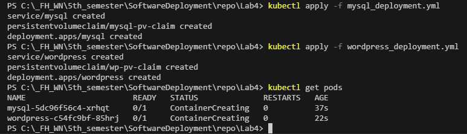
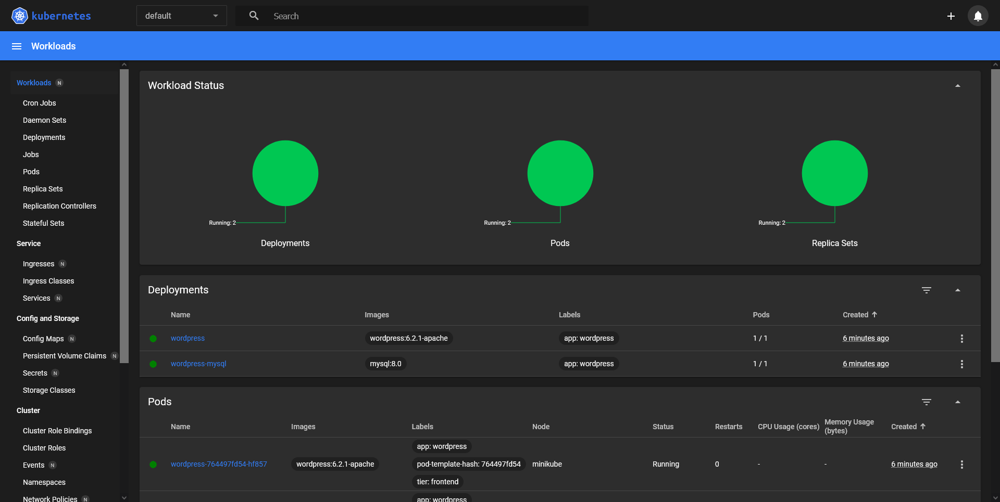
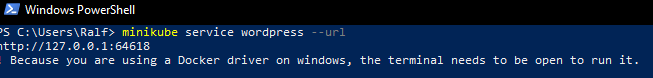

# Lab4 Kubernetis

## Wordpress config

Die [Wordpress config Datei](wordpress_deployment.yml) erstellt sowohl das Deployment, als auch das Service und den permanenten Speicher.

### Service
Im Service wird festgelegt welcher Port exposed wird.
Zusätzlich ist es noch als LoadBalancer eingestellt, was heißt dass externe Request zu diesem Service weiter geleitet werden.

### Storage
Der PersistentVolumeClaim ist ein persistenter Speicher wie die Volumes in Docker.
Mit dem Modus ReadWriteOnce wird festgelegt, dass nur eine Node auf diese Volume zugreifen kann. Es wird eine größe von 20Gi für diesen Speicher festgelegt.
Verwendet wird das Volume im Deplyoment.

### Deplyoment
Im deployment wird festgelegt welches Image für das erstellen des Containers verwendet wird.
Zusätzlich werden noch die Environment variablen, welche in diesem fall für die Konfiguration verwendet werden, festgelegt.
Die environment Variable für das Passwort wird mit einem vorher erstellten Secret befüllt.
Zusätzlich wird noch der persistente speicher eingebunden und der Port der intern freigegeben wird.
Ebenso kann eine deployment Strategie eingestellt werden, welche für dieses Deployment nur festlegt, dass bei einem Fehler das Service restartet werden soll.

## Mysql config

Die [Mysql config Datei](mysql_deployment.yml) erstellt sowohl das Deployment, als auch das Service und den permanenten Speicher.

### Service
Im Service wird festgelegt welcher Port exposed wird.
Mit clusterIP: None wir eingestellt, dass dieser Service keine Cluster IP bekommt, wodurch der Zugriff nur über Name resolution erfolgen kann.

### Storage
Der PersistentVolumeClaim ist ein persistenter Speicher wie die Volumes in Docker.
Mit dem Modus ReadWriteOnce wird festgelegt, dass nur eine Node auf diese Volume zugreifen kann. Es wird eine größe von 20Gi für diesen Speicher festgelegt.
Verwendet wird das Volume im Deplyoment.

### Deplyoment
Im deployment wird festgelegt welches Image für das erstellen des Containers verwendet wird.
Zusätzlich werden noch die Environment variablen, welche in diesem fall für die Konfiguration verwendet werden, festgelegt.
Die environment Variable für das Passwort wird mit einem vorher erstellten Secret befüllt.
Zusätzlich wird noch der persistente speicher eingebunden und der Port der intern freigegeben wird.
Ebenso kann eine deployment Strategie eingestellt werden, welche für dieses Deployment nur festlegt, dass bei einem Fehler das Service restartet werden soll.

## Verwendung

Minikube muss mit dem Befehl `minikube start` gestartet werden, dabei wird eine locale kubernetis instanz installiert und gestartet. Um das ganze auf windows zu verwenden muss, wenn Hyper-V aktivert ist, der Befehl `minikube start --driver=hyperv` ausgeführt werden. Alternativ kann auch Docker verwendet werden mit `minikube start --driver=docker`.

Befor die Services und Deployments erstellt werden können mus das `mysql-pass` secret erstellt werden. Dafür wird der Befehl `kubectl apply -f secrets.yml`. 

*Erstellte Secrets*

Um die Deployments, Services und persistenten Speicher zu erstellen und starten kann das Script `create.bat` verwendet werden, es können jedoch die Befehle aus diesem einzeln verwendet werden.

*Einzelne Befehle um Services, Deployments und persistente Speicher zu erstellen*

*Übersicht über die erstellten Deployments und Pods*

Um die URL des erstellten Services zu bekommen muss der Befehl `minikube service wordpress --url` ausgeführt werden.

*Ausführen des Befehls um die externe URL zu bekommen*

Sollte man die Services, Deployments und persistenten Speicher wieder löschen wollen, kann das Script `delete.bat` aufgerufen werden. Alternativ können die Befehle auch einzeln ausgeführt werden um nur einzelne Komponenten zu löschen.
